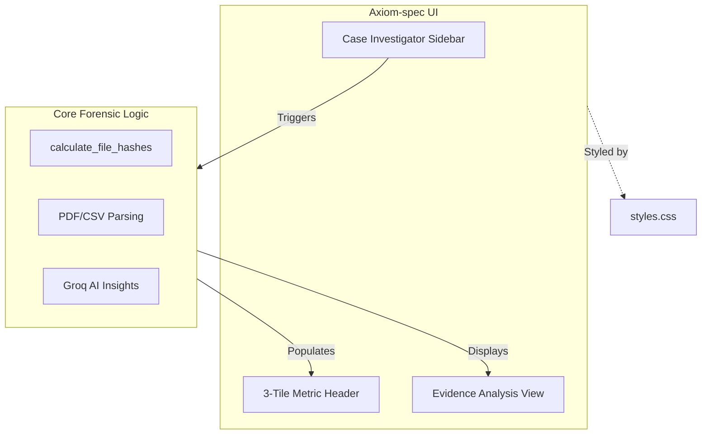

# Implementation Plan: Axiom-spec UI for Truth OS

## 1. Visual Identity (styles.css)
Create a `styles.css` file to define the 'Axiom-spec' aesthetic.
- **Palette**: Deep Navy (#0A0E14) as the primary background, Cyan (#00D1FF) for accents and borders.
- **Typography**: Monospace or clean Sans-serif for a technical feel.
- **Components**:
    - Custom styling for `stMetric` to look like high-fidelity tiles.
    - Sidebar styling to reflect the 'Case Investigator' theme.
    - Glow effects for buttons and active states.

## 2. Layout Refactor (app.py)
The UI will be restructured to match the Axiom-spec requirements without altering the underlying logic.

### A. 'Case Investigator' Sidebar
- **Operator Authentication**: Retain and restyle the Operator ID login.
- **Evidence Upload**: The primary upload zone for CSV/PDF files.
- **Investigation Controls**: Buttons for 'Run AI Analysis' and 'Clear Case'.

### B. 3-Tile Metric Header
- Top-level status indicators using `st.columns(3)`:
    - **System Integrity**: (Pulse/Percentage)
    - **Evidence Count**: (Active/Total)
    - **Threat Level**: (Clean/Anomaly)

### C. Core Logic Mapping
The existing functions in [`forensics/forensic_tools.py`](forensics/forensic_tools.py) will be preserved:
- `calculate_file_hashes`: Called after file upload to populate the integrity tile.
- `get_file_type`: Used for dynamic UI branching (PDF vs CSV view).
- `extract_pdf_metadata`: Displayed in a specialized 'PDF Forensic' tile.
- `get_direct_ai_insights`: Triggered by the investigator sidebar.

## 3. Implementation Steps
1.  **Style Injection**: Modify `app.py` to read and inject `styles.css`.
2.  **Structural Update**: Move UI elements into the sidebar and header columns.
3.  **Thematic Skinning**: Apply CSS classes to Streamlit containers to achieve the Deep Navy/Cyan look.
4.  **Verification**: Ensure all file processing results are correctly displayed in the new layout.

---

## Proposed Architecture



## CSS Mockup Preview
```css
/* Palette Preview */
:root {
    --deep-navy: #0A0E14;
    --cyan: #00D1FF;
}

.stApp {
    background-color: var(--deep-navy);
    color: var(--cyan);
}
```

---
**Do you approve of this layout and styling plan?**